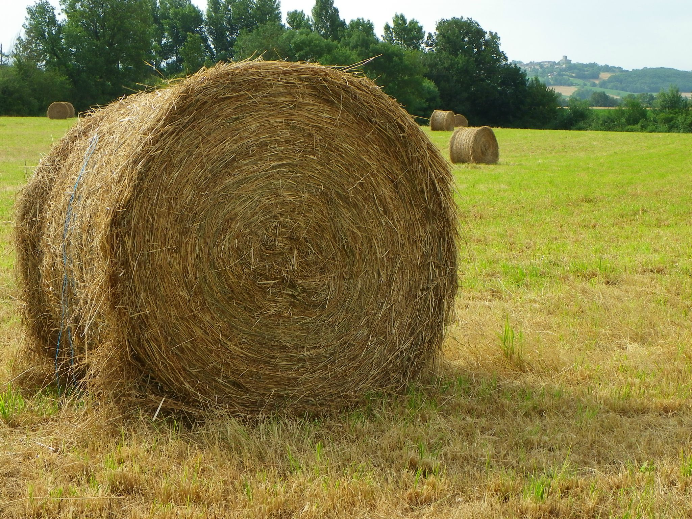

# Don't know how to sort...

A
---
### Atterrir/revenir sur terre
  - Revenir à la réalité (pour quelqu'un de distrait/dans le nuage/dans la lune)

B
---
### C'est ballot.
  - C'est bête. C'est dommage. C'est con. C'est simple.
  - Ballot de foin

    

### On bouge. /On décolle.
  - On y va.

C
---
### Démarrer sur les chapeaux de roues

### Un rire/une voix de crécelle
  - aigüe, criard, griçant, désagréable
    _Une couleur criarde_

D
---
### J'ai/je creve la dalle.
  - J'ai (très) faim.

### L’argent lui brûle les doigts. / C’est un panier percé.

E
---
### Monter ... en épingle = en faire tout un cirque/pataquès/fromage
  - Agraver quelque chose/un problème qui n'en veut pas la peine
  - Pataquès : liaison fautive

F
---
### C'est jour de fête.
  - [Pas d'article devant &laquo; jour &raquo;]

### Je m'en fou/fiche.
  - Je m'en tamponne-
    + - l'oreille avec une babouche.
    + - le coquillard en cadence.
  - Je m'en bats-
    + - l'&oelig;il avec...
    + - les couilles.

G
---
### Faire gaffe
  - faire attention

L
---
### Pourvoir se cacher derrière un lampataire
  - être très maigre

M
---
### Une régularité de métronome
  - très régulier

N
---
### Tous les machins de France et de Navarre

P
---
### Ça coûte la peau des fesses/un bras/une jambe.

### Habiter à perpète,-lès-Oies.
  - Perpète : endroit lointain/isolé
  - -lès-Oies : nom utilisé souvent pour des régions rurales

### C’est du pipeau.
  - :gb: It is a lie.
  - Tu racontes des salades.

### Mettre qqn au placard

R
---
### Retomber sur ses pattes/pieds

S
---
### C'est tout un sketch/film/cirque. = faire le clown
  - faire n'import quoi ; agir bizarrement

### Sauter du coq à l'âne
  - Fait de passer brusquement d'un sujet à un autre dans une conversation

T
---
### C'est un coup à double tranchant :cn: 双刃剑

V
---
### Passer en coup de vent
  - Passer très vite, ne pas rester :cn:（取了东西）就走
