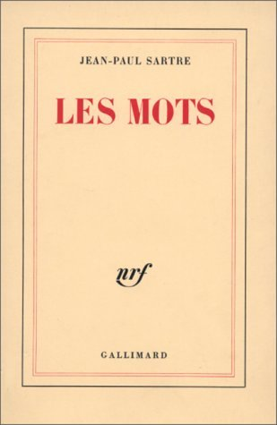
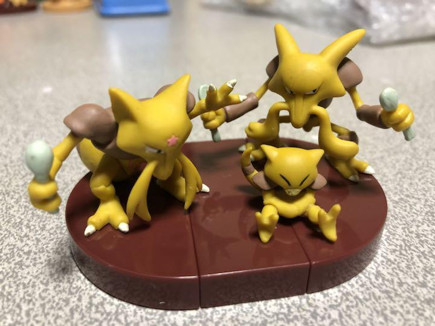
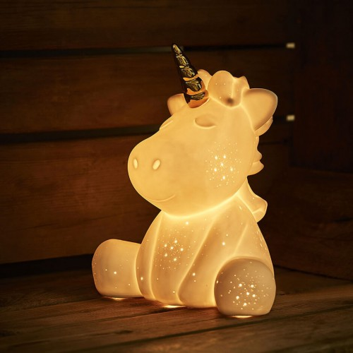

# Les Mots

A
---
### abracadabra
  - formule magique
    + adj. abracadabrant
    + [POKÉMON] Abra - Kadabra - Alakazam
	
	  

B
---
### pas de bol
  - pas de chance

    _C'est sympa de mettre l'ordinateur d'un informaticien par example dans un bol._ (Pour ne pas avoir des bugs. ) [C'est une blague.]

C
---
### calculs d'apothicaire	
  - petits calculs bancals ou très approximatifs
  - apothicaire : semi-alchimiste, herboriste, préparateur de remèdes
### choper
  - aller chercher, attraper, joindre (quelqu'un)
### compulsion
  - TOC : Touble Obsessionel Compulsif (que le sujet n'arrive pas à réfréner) :cn: 强迫症

    Toqué : qui a des TOC, fou

    adj. Toc-toc : se dit de quelqu'un qui est fou/idiot
  - [à ne pas confondre] Toque : sorte de chapeau (toque en fourrure, toque de chef cuisinier, etc.)

    Toqué : appliqué à certaines récompenses culinaires
  - Pulsion : envie soudaine et très forte, difficile à réfréner

D
---
### draconien
  - très strict, très dur
  - lié aux dragons

E
---
### étouffe-chrétien
  - cchose dense et sèche, peu agréable à manger (e.g. déssert au caramel)
### étrenner
  - Faire usage d’une chose pour la première fois.

F
---
### être friand de
  - aimer et s'y connaître

H
---
### hurluberlu
  - :uk: hurly-burly

K
---
### kitsch ou kitch

  
  - Dans les œuvres d’art: juxtaposition, accumulation, enfance, société de consommation, cadres dorées, syncrétisme religieux, etc. [En savoir plus](https://mlleaartus.wordpress.com/2017/07/27/le-kitsch-cest-quoi/)

P
---
### picoler
  - :cn: 不醉不归
### pique-assiette
  - :cn: 吃白食的人

S
---
### sustenter
  - :cn: 维持生计(吃)
