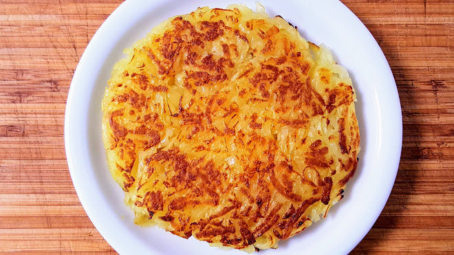

# One Piece

### aboi
  - Luffy, de nouveau aux abois. Gear Fourth contre Donuts ! :cn: 走投无路
    + origine : Ep. 858
  
### affaire
  - Tu auras affaire à moi.
    + cf. Tu auras à faire à moi.
  - Ils sont loin d'être tirés d'affaire.
    + s'en sortir
  
### air
  - Ce n'est pas une parole en l'air.
    + en l'air :arrow_right: sans fondement, sans importance
  - C'est pour tout ficher/foutre en l'air.
    + détruire, anéantir
  
### barreau
  - Il finit par être envoyé derrière les barreaux.

### bavé
  - J'en ai bavé. :cn: 苦头
  
### bien
  - ..., bel et bien.
  - ..., vite fait, bien fait.
  - Grand bien te fasse ! :gb: Good for you...
  
### brin
  - Tu n'as pas changé d'un brin.
  
### canon
  - C'est un vrai canon, elle !
    + se dit d'une femme au physique parfait, d'une beauté hors du commun
  
### chausette
  - Elle m'a jeté comme une vieille chausette.
  
### citron
  - Tu n'en as rien dans le citron.
    + ne pas être très malin
  
### chaos
  - À l'age de 18 ans, il continue de se mettre la pagaille.
  - T'es un vrai gamin. Pourquoi t'es incapable de t'infiltrer faire du grabuge.
  - faire du bagarre

### classe
  - La classe !
  
### clocher
  - Il y a un truc qui cloche.
  
### cochon
  - Quel caractère de cochon, cette nana.
    + mauvais caractère
  
### colère
  - Je suis vraiment en pétard.
  
### coup
  - On a fait les quatre cents coups ensemble.
    + faire beaucoup de bruit et de tapage
    + origine : Louis XIII assiégeant la ville de Montauban, fit tirer 400 coups de canon
  - La Rêverie de cette année était parsemée de coups du sort.
    + problème inutile et imprévu résultant d'un événement malheureux

### cracher
  - Allez, crachez le morceau.
    + dire ce que l'on sait
  
### dernier
  - Je n'ai pas dit mon dernier mot.
    + Il n'a pas eu son compte.
    + Sa dernière heure a sonné.
    + Il a signé son arrêt de mort.
  
### eau
  - Tout notre plan risque de tomber à l'eau.
    + échouer, être oublié
  
### éponge
  - Hors de question que tu jettes l'éponge. :gb: to throw in the towel
  
### esgourde
  - Ouvre grand tes esgourdes. Un sabre, c'est un couteau à humains.
    + Écoutes. oreille
  
### étoile
  - Tu as vraiment une bonne étoile / ange gardien kiffé,e sur toi.
  
### gaffe
  - Fais gaffe de ne pas tomber.
  
### haricots
  - C'est la fin des haricots.
    + Cette expression a été utilisée pour parler d'une situation critique, avec la perte de tout espoir.
  
### léger
  - Prenez pas la mer à la légère.
    + sans avoir pesé les choses, sans réfléchir
  
### lest
  - Comme s'il y avait pas assez de feu dans ce château... Et tu pourrais lâcher/jeter du lest avec tes hommes. :cn: 丢卒保车
  
### main
  - Le cuistot a eu la main lourde.
  
### moral
  - Snatch ! C'est une formule magique qui te donne le moral.
    + redonner de l'espoir, consoler
  
### morceau
  - Tu a réussit à revenir en un seul morceau.
    + bien portant, en pleine forme
  
### oignon
  - Mêle/occupe-toi de tes oignons.
  
### paumé
  - Zoro est encore paumé...
    + perdu
  
### point
  - Vous tombez à point nommé.
  
### prendre
  - Mais il se prend pour qui ?
  - Qu'est-ce qui te prend ?
    + Qu'y a-t-il ? que se passe-t-il ?, pourquoi agis-tu ainsi ?
  
### raclette
  - Il s'est pris une (bonne) raclette.
  - Je vais lui mettre la raclette.
    + Je vais lui faire la fête.
    + Je vais lui faire la peau.
	  * cf. avoir qqn dans la peau :arrow_right: arriver pas à renoncer à une relation toxique
    + Je vais lui régler son compte.
	+ Je vais lui apprendre une (bonne) manière/leçon.
  
### reconnaissant
  + Je te remercie du fond du cœur.
  + Je te dois une fière chandelle.
  
### rester
  - Il faut rester zen.
  - On ne peut pas rester les bras croisés.
    + cf. Un bras cassé :arrow_right: Personne sur laquelle on ne peut compter, incapable, bon à rien.
  
### rouler
  - Laissez-nous faire rouler sa tête sur le sol.
    + décapiter qqn.
  
### taille
  - Je ne suis pas taillé / de taille (pour ce conflit).
  - Il faut que je sois à la hauteur (de ce défi).
  - Tu ne fais pas le poids (contre moi).
  - Je ne suis pas en mesure de t'aider.
  
### tapis
  - Linlin ! Ils l'ont mise au tapis !
    + anéantir
  
### tête
  - Mais ça va pas la tête ?
    + Mais tu es devenu fou ? / tu es déraisonnable / tu délires !
  
### trouble-fête
  - Ils délirent ? Le chapeau de paille affronte Kaido. Et je suis censé aller jouer les trouble-fête ?
  
### veste
  - Il a retourné sa veste.
    + Changer de camp ou d'opinion par intérêt et non en vertu de principes moraux, afin de saisir une occasion ou d'échapper à une menace.
    + origine : :it: voltare casacca
  
### Espèce... / Bande...
  - d'abruti
  - de bestiole
  - de chauffard
  - de cinglé
  - de (gros) cornichon
  - de (vieux/sale) crétin
  - de (vieux) croûton
  - de dure à cuire
  - d'enfoiré
  - de fumier
  - d'idiot
  - de mioche
  - de microbes
  - de misérable
  - de (sale petit) morveux
  - de nazes
  - d'ordures
  - de (vieux) schnock
  - de vermine
  
### Baratie
  - N'oublie pas la bibine...
    + boisson, bière de mauvaise qualité

  - Tu m'a fait rouler dans la farine.
    + tromper qqn.
	
  - Elle m'a pris pour un jambon !
    + pour se faire enfumer
  
  - Tu me prends comme un paillasson, quoi ?
    + Paillasson de pomme de terre
  
      
  
  - Pour sûr, je n'ai pas à m'en faire pour sa pomme.
    + s'inquiéter pour lui
  
  - Ce sont des salades.
    + Raconter des mensonges/contradictions/inventions/mauvaises excuses/propos confus.
  
  - Tu récoltes ce que tu sèmes !
  
  - J'ai plus de jus pour lui tenir tête.
    + ne plus avoir d'énergie
  
### Haki / Fluide
  - J'en ai aucune idée, mais en tout cas, un milliard de que ce soit, ça m'a l'air de faire une sacrée somme.
  
  - Je suis partant !
  
  - Je dois le remets en état.
  
  - C'est comme ci c'était fait.
  
  - On est fait comme des rats !
    + être capturé, ou pris en flagrant délit
    + origine : _Voyage au bout de la nuit_ de Céline.

  - Le hasard fait bien des choses !
  
  - Pour le meilleur et pour le pire.
  
  - Tu dégages sinon je t'en colle une jamais vu un mec comme toi t'es une merde.
  
  - Pardonnez-moi, madame, mon impertinence. Auriez-vous la gentillesse de me laisser mirer vos affriolants dessous.
  
  - La vérité ne fera que provoquer la confusion au sein des esprits.
  
  - Je suis pas en position de pinailler sur ma réputation.
  
  - Cette jeune femme, c'est ma fille... C'est un membre à part entière de notre famille. Et vous voudriez nous séparer d'elle. Si c'est ce que vous voulez, soyez prêts à mourir !
