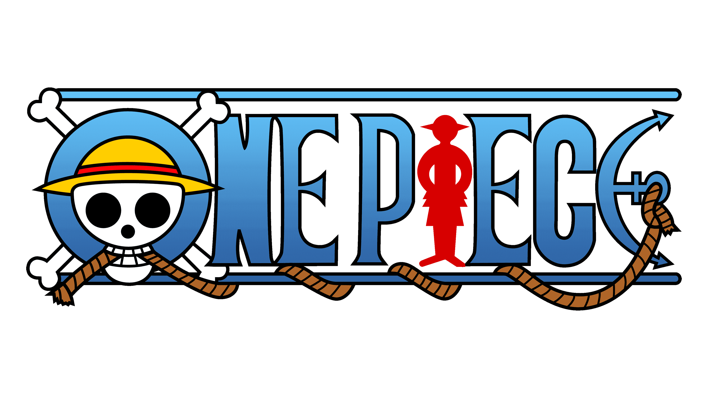

# One Piece

### bien
  - ..., bel et bien.
  - ..., vite fait, bien fait.
  
### citron
  - Tu n'en as rien dans le citron.
    + ne pas être très malin
  
### classe
  - La classe !
  
### clocher
  - Il y a un truc qui cloche.
  
### cochon
  - Quel caractère de cochon, cette nana.
  
### colère
  - Je suis vraiment en pétard.
  
### étoile
  - Tu as vraiment une bonne étoile / ange gardien kiffé,e sur toi.
  
### farine
  - Tu m'a fait rouler dans la farine.
  
### raclette
  - Il s'est pris une (bonne) raclette.
  - Je vais lui mettre la raclette.
    + Je vais lui faire la fête.
    + Je vais lui faire la peau.
	  * cf. avoir qqn dans la peau :arrow_right: arriver pas à renoncer à une relation toxique
    + Je vais lui régler son compte.
  
### gaffe
  - Fais gaffe de ne pas tomber.
  
### oignon
  - Mêle/occupe-toi de tes oignons.
  
### salades
  - Ce sont des salades.
    + Raconter des mensonges/contradictions/inventions/mauvaises excuses/propos confus.
  
### zen
  - Il faut rester zen.
  
### Haki / Fluide
  - On ne peut pas rester les bras croisés.
  
  - Il faut lui apprendre une bonne manière/leçon.
  
  - Il faut que je sois à la hauteur (de ce défi).
    + Je ne suis pas taillé / de taille pour ce conflit.
  
  - Tu ne fais pas le poids (contre moi).
  
  - Tu auras affaire à moi.
    + cf. Tu auras à faire à moi.
  
  - J'en ai aucune idée, mais en tout cas, un milliard de que ce soit, ça m'a l'air de faire une sacrée somme.
  
  - Je n'ai pas dit mon dernier mot.
    + Il n'a pas eu son compte.
  
  - Je suis partant.
  
  - Je dois le remets en état.
  
  - C'est comme ci c'était fait.

  - On est fait comme des rats !
    + être capturé, ou pris en flagrant délit
    + origine : _Voyage au bout de la nuit_ de Céline.
