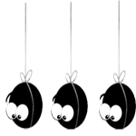
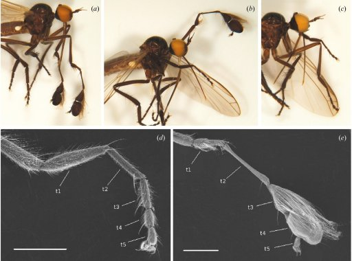

# Signes de ponctuations

### -
  - Tiret (simple) / tiret de césure / trait d'union

### _
  - Tiret (en) bas :gb: underscore

### ~
  - Tilde

### !
  - Point d'exclamation

### ?
  - Point d'interrogation

### ...
  - Points de suspension :gb: ellipsis
    
	

### •
  - Puce :gb: bullet
  - Unicode : U+2022

### `
  - Guillemet-apostrophe culbuté / guillemet inversé :gb: backtick
  - Unicode : U+0060

### «»
  - Guillemets (ouvrants/fermants)

### ‘’
  - Guillemet-virgule haute (culbuté/apostrophe)

### “”
  - Guillemets-virgules doubles

### '
  - Apostrophe

### "
  - Guillemets doubles

### ()
  - Parenthèses (ouvrantes/fermantes)

### []
  - Crochets (ouvrants/fermants)

### {}
  - Accolades (ouvrantes/fermantes) :gb: (open/close) curly brackets/braces

### |
  - Barre verticale

### /
  - Barre oblique / barre de fraction :gb: slash

### \
  - Barre oblique inverse, contre-oblique :gb: backslash

### @
  - Arobase

### \# 
  - Croisillon / dièse / hashtag

### $
  - Dollar

### %
  - Pourcent

### ^
  - Accent circonflexe :gb: circumflex
  - Unicode : U+0058

### &
  - Esperluette

### *
  - Astérisque

### °
  -  Degré

### †
  - Obèle
  - ‡ : double obèle

### §
  - Symbole de paragraphe

### ¶
  - Pied-de-mouche
  
	
