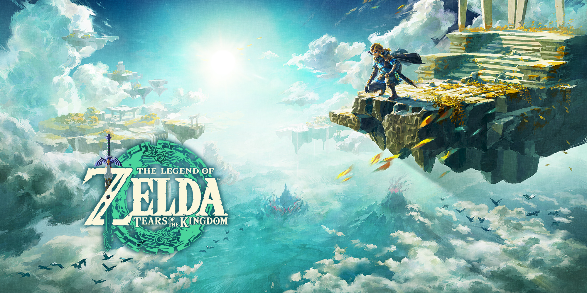

# The Legend of Zelda

### bile
  - Hier encore, elle avait l'air contente quand elle en parlait. Je suis sûre que tu te fais de la bile pour rien.
    + s'inquiéter ; se faire du souci
  
### calé
  - Tu trouveras personne de plus calé sur les affaires du royaume !
  - un problème calé
  
### cancan
  - Une rumeur, voyez-vous ça... Normalement, je prête juste zéro attention auuux cancans, et j'encourage même à les tuer dans l'œuf.

### combat
  - le combat à distance :arrows_counterclockwise: le combat en mêlée
  
### épater
  - Ça m'épate.
  
### guise
  - N'hésite pas à utiliser toutes les installations de cet abri à ta guise.

### manche
  - Quand un royaume manque de main-d'œuvre, le roi doit savoir se retrousser les manches.
  
### mouron
  - se fait du mouron :cn: 自寻烦恼
  
### pain
  - On a encore du pain sur la planche.
    + avoir en perspective beaucoup de tâches fastidieuses à accomplir
  
### roupillon
  - faire/piquer un roupillon = une sieste
